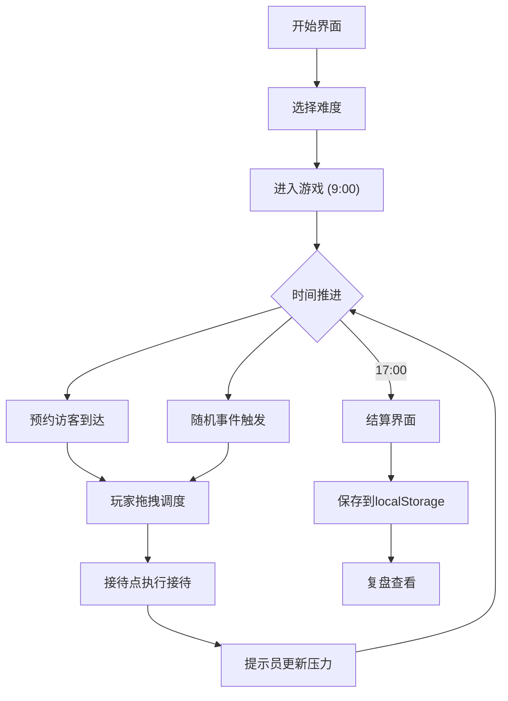

## 1. 产品概述

展厅队列调度小游戏是一款单机策略模拟游戏，玩家在展厅开放时段内扮演调度员，通过拖动预约卡调整接待顺序、安排讲解员休息、临时加场和缓解拥挤，目标是让访客等待时间和投诉数量尽量低。

- 核心目标：锻炼玩家的优先级判断与资源调配能力
- 目标用户：喜欢轻度策略/模拟经营的休闲玩家

## 2. 核心功能

### 2.1 角色身份

| 角色 | 职责 | 表现形式 |
|------|------|----------|
| 调度员（玩家） | 调整队列顺序、安排加场、暂停接待点 | 主动操作面板 |
| 提示员 | 展示当前压力变化、预警信息 | 实时状态面板 |
| 结算员 | 显示得分和复盘数据 | 结算复盘面板 |

### 2.2 功能模块

1. **游戏主界面**: 时间轴、队列区、接待点状态、操作面板
2. **开始界面**: 游戏说明、难度选择、历史成绩
3. **结算复盘界面**: 得分统计、事件回顾、历史对比

### 2.3 页面详情

| 页面名称 | 模块名称 | 功能描述 |
|----------|----------|----------|
| 开始界面 | 游戏说明 | 展示游戏规则和操作方式 |
| 开始界面 | 难度选择 | 普通/困难两种模式，影响事件密度和讲解员数量 |
| 开始界面 | 历史成绩 | 从localStorage读取并展示历史最佳分数 |
| 游戏主界面 | 时间轴 | 展示当前游戏时间（9:00-17:00），带进度条 |
| 游戏主界面 | 队列区 | 展示等待中的预约卡，支持拖拽排序 |
| 游戏主界面 | 接待点状态 | 展示各接待点的占用/空闲/维护状态 |
| 游戏主界面 | 提示员面板 | 实时压力值、投诉计数、预警弹窗 |
| 游戏主界面 | 操作面板 | 加场按钮、暂停/恢复接待点、加速时间 |
| 游戏主界面 | 事件通知 | 临时团体到达、讲解员休息、维护事件的时间触发通知 |
| 结算复盘界面 | 得分统计 | 等待时间得分、投诉扣分、总评分 |
| 结算复盘界面 | 事件回顾 | 按时间线展示所有事件和玩家决策 |
| 结算复盘界面 | 历史对比 | 与历史最佳成绩对比 |

## 3. 核心流程

玩家进入游戏后，展厅从9:00开放到17:00。游戏时间以加速方式推进，期间预约访客陆续到达。玩家需要：
1. 将预约卡拖入接待点安排接待顺序
2. 关注提示员的压力预警，优先安排等待过久的团队
3. 响应随机事件（临时团体到达、讲解员休息、接待点维护）
4. 利用加场和暂停功能灵活调配资源
5. 在17:00闭馆后进入结算，查看得分和复盘

## 4. 用户界面设计

### 4.1 设计风格

- **主色调**: 深蓝灰(#1e293b)背景 + 琥珀色(#f59e0b)强调色，营造展厅专业感
- **辅助色**: 翡翠绿(#10b981)表示正常状态，玫红(#f43f5e)表示告警
- **按钮风格**: 圆角卡片式按钮，hover时微微上浮 + 阴影加深
- **字体**: 标题使用 Noto Serif SC（衬线体，展厅氛围），正文使用 Noto Sans SC
- **布局风格**: 左侧队列区 + 中间接待点 + 右侧提示员面板，三栏布局
- **卡片风格**: 圆角、微阴影、左侧彩色条纹标识优先级
- **图标风格**: lucide-react 线性图标

### 4.2 页面设计概览

| 页面名称 | 模块名称 | UI元素 |
|----------|----------|--------|
| 开始界面 | 游戏说明 | 卡片式布局，深色背景配金色装饰线 |
| 开始界面 | 难度选择 | 两个大按钮卡片，hover放大效果 |
| 开始界面 | 历史成绩 | 简洁数据列表，带排名徽章 |
| 游戏主界面 | 时间轴 | 顶部横条进度条，显示当前时间和剩余 |
| 游戏主界面 | 队列区 | 纵向卡片列表，拖拽排序，卡片有优先级色条 |
| 游戏主界面 | 接待点 | 横排卡片，显示状态色块和当前接待团队 |
| 游戏主界面 | 提示员 | 右侧面板，压力仪表、投诉计数、预警列表 |
| 游戏主界面 | 操作面板 | 底部固定操作栏，加场/暂停/加速按钮 |
| 游戏主界面 | 事件通知 | 右上角弹出通知卡片，3秒自动消失 |
| 结算复盘界面 | 得分统计 | 大号数字展示，动画计数效果 |
| 结算复盘界面 | 事件回顾 | 时间线列表，交替左右布局 |
| 结算复盘界面 | 历史对比 | 柱状对比卡片 |

### 4.3 响应式设计

- 桌面优先设计，最小宽度1024px
- 三栏布局在窄屏下改为上下堆叠
- 预约卡片支持鼠标拖拽和点击上移/下移按钮

### 4.4 动画效果

- 卡片拖拽时有微微旋转和阴影变化
- 事件通知从右侧滑入、淡出
- 压力值变化时数字有缓动效果
- 结算得分有数字滚动动画
- 接待点状态切换有颜色渐变过渡
