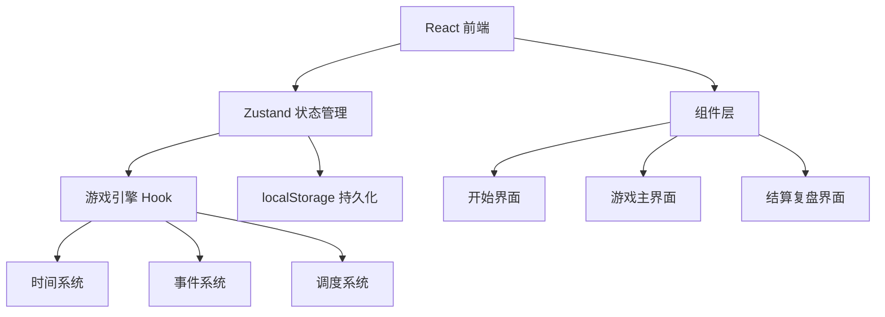

## 1. 架构设计



## 2. 技术说明

- 前端: React@18 + TypeScript + TailwindCSS@3 + Vite
- 初始化工具: vite-init (react-ts 模板)
- 状态管理: Zustand
- 后端: 无（纯前端单机游戏）
- 数据持久化: localStorage

## 3. 路由定义

| 路由 | 用途 |
|------|------|
| / | 开始界面：游戏说明、难度选择、历史成绩 |
| /game | 游戏主界面：时间轴、队列、接待点、提示员面板 |
| /result | 结算复盘界面：得分统计、事件回顾、历史对比 |

## 4. 数据模型

### 4.1 核心数据结构

```typescript
interface VisitorGroup {
  id: string
  name: string
  size: number
  arrivalTime: number
  patience: number
  isVip: boolean
  type: 'individual' | 'group' | 'tour'
}

interface ReceptionPoint {
  id: string
  name: string
  status: 'idle' | 'busy' | 'maintenance' | 'paused'
  currentGroup: VisitorGroup | null
  finishTime: number | null
  maintenanceUntil: number | null
}

interface GameEvent {
  id: string
  type: 'group_arrival' | 'guide_break' | 'maintenance' | 'vip_arrival'
  triggerTime: number
  data: Record<string, unknown>
  resolved: boolean
}

interface GameState {
  currentTime: number
  startTime: number
  endTime: number
  difficulty: 'normal' | 'hard'
  queue: VisitorGroup[]
  receptionPoints: ReceptionPoint[]
  pendingEvents: GameEvent[]
  triggeredEvents: GameEvent[]
  complaints: number
  totalWaitTime: number
  servedCount: number
  pressure: number
  isPaused: boolean
  speed: 1 | 2 | 3
}

interface GameResult {
  id: string
  difficulty: 'normal' | 'hard'
  score: number
  complaints: number
  totalWaitTime: number
  servedCount: number
  events: GameEvent[]
  timestamp: number
}
```

### 4.2 localStorage 存储结构

- `queue-game-results`: GameResult[] - 历史成绩列表
- `queue-game-best-normal`: number - 普通难度最佳分数
- `queue-game-best-hard`: number - 困难难度最佳分数

## 5. 核心系统设计

### 5.1 时间系统

游戏时间范围：9:00-17:00（共480分钟）
- 使用 requestAnimationFrame 驱动
- 每帧推进 deltaTime * speed 的游戏时间
- 1x速度: 1秒现实时间 = 1分钟游戏时间
- 2x速度: 1秒现实时间 = 2分钟游戏时间
- 3x速度: 1秒现实时间 = 3分钟游戏时间

### 5.2 事件系统

事件按触发时间排序存储，游戏时间推进时检查是否有事件需要触发：
- 团体到达：在预设时间生成新的 VisitorGroup 加入队列
- 讲解员休息：指定接待点在指定时间变为 maintenance 状态
- 接待点维护：指定接待点暂停一段时间
- VIP到达：高优先级访客，等待更久投诉概率更高

### 5.3 调度系统

- 玩家拖拽预约卡到接待点进行分配
- 接待点根据团队大小自动计算接待时长（size * baseDuration）
- 接待完成后自动变为idle，通知玩家可分配新团队
- 玩家可暂停/恢复接待点
- 临时加场：消耗"加场次数"增加一个临时接待点（限时）

### 5.4 压力与投诉系统

- 压力值 = (队列总人数 × 权重) + (平均等待时间 × 权重) + (已投诉数 × 权重)
- 每个团队有耐心值，等待超过耐心值后产生投诉
- 投诉产生时提示员面板闪烁告警

### 5.5 评分系统

- 基础分 = 已接待团队数 × 100
- 等待加分 = max(0, 500 - 总等待时间)
- 投诉扣分 = 投诉数 × 50
- 最终得分 = 基础分 + 等待加分 - 投诉扣分
